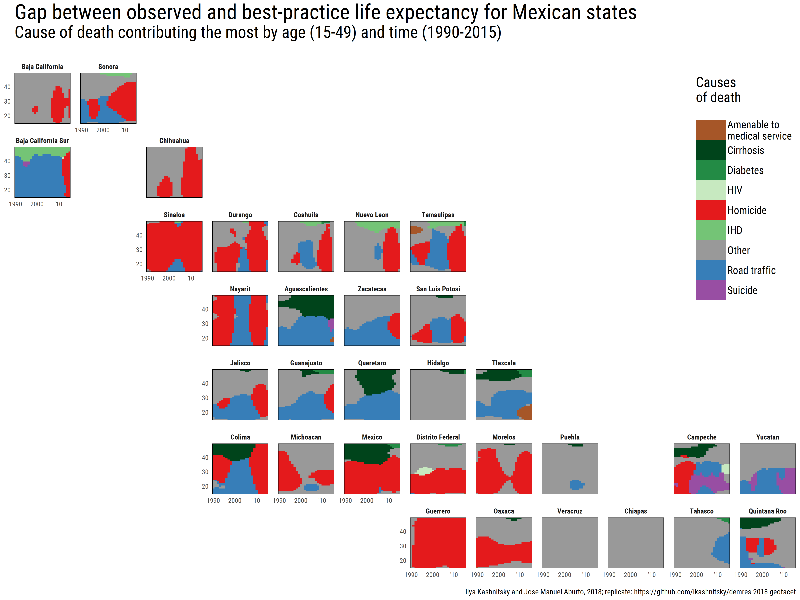

```{r setup, include=FALSE}
library(knitr)
knitr::opts_chunk$set(fig.width = 6, 
                      fig.height = 3.6,
                      out.width = "75%",
                      warning = FALSE)
```


# Introduction

Data visualization is quite often a struggle to represent multiple relevant dimensions preserving readability of a plot. 

The spailial logic of small-mulitples allignment helps to sidentify the units of analysis faster and reveils the macro-level spatial pattern. 


> What’s new about this R package is that it formalizes the “geofaceting” approach, gives it a name, and makes it available in a user-friendly way. Also, it provides the basis for creating a library of community-contributed grids, which can be used elsewhere outside the package. [@hafen2018rh]


# Data

The analyses rely on the results from [@aburto2018f]. These are based on publicly available anonymized datasets from official files produced by the Mexican Statistical Office from 1990 to 2015 [@INEGI]. These data contain information on causes of death by single age, sex, and state of residence at the time of death. Population estimates from 1990 to 2015 came from the Mexican Population Council. These estimates adjust for age misstatement, undercounting, and interstate and international migration.

 

## Classification of Causes of Death

We analyzed homicide, road traffic accidents, and suicide because they have emerged as leading causes of death among young people, and the first two recently had a sizeable impact on life expectancy recently in Mexico [@aburto2016ha]. All causes of death were classified using the International Classification of Diseases, revision 9 for the period 1990-1997 and the tenth revision for 1998-2015. We focus on ages between 15 and 50 capture the effect of homicide mortality and external causes, historically related to the young-adult mortality jump. This age group had an important impact on changes in state life expectancy in the first decade of the 2000s.

 

# Demographic Methods

Cause-specific death rates were smoothed over age and time for each state and sex separately using the 2-d p-spline to avoid random variations between ages [@camarda2012jss]. Smoothed death rates are then constrained to sum to the unsmoothed all-cause death rates. Period life tables were constructed for males and females from 1990 to 2015 following standard demographic methods [@preston2001]. We calculate the average years lived between ages 15 and 50 (temporary life expectancy) [@arriaga1984d] and estimate cause-specific contributions to the difference between state-specific temporary life expectancy and the low mortality benchmark using standard decomposition techniques [@horiuchi2008d].

 

## Low mortality benchmark

The low-mortality benchmark is calculated in the basis of the lowest observed mortality rates by age, cause of death, from among all states for a given sex and year. The resulting minimum mortality rate schedule has a unique age profile, and it determines our benchmark temporary life expectancy. The minimum mortality schedule can be treated as the best presently achievable mortality assuming perfect diffusion of the best available practices and technologies in Mexico [@vallin2008p]. This value is a practical reference because it is based neither on a projection of improvements into the future nor on an arbitrary and likely dissimilar population.


# Visualization techniques

## Geofaceting

As there is substantial regional variance in premature male mortality across Mexican states, the proper way to visualize it has to the spatial dimension of the dataset. Usually, it’s quite difficult to show time series with choropleths: one has to produce either small multiples or animated picture with maps for various years flashing sequentially. Both variants makes it quite difficult to compare regions across years. The solution is to use geofaceting, a visualization technique recently streamlined in R with the package `geofacet` [@hafen2017].

The idea of geofaceting is brilliantly simple: a normal plot is produced for each of the regions, and then all the small panels are arranged according to the geographic location of the regions. Geofaceting makes it really easy to identify regions because we usually have a pretty good idea where to look for them. And creating a geofaceted visualization we have all the advantages of normal plots in which we can easily display three dimensions of the dataset.

As there was no geofacet layout for Mexico, we created it from the scratch. It was really easy, as the task is well streamlined in the `geofacet` package. The produced grid for Mexican states was successfully submitted to `geofacet` package [@kashnitsky2017ga].


## Lexis surface heatmaps


## Ternary colorcoding

One interesting technique is to maximize the amount of information conveyed by colors -- *ternary colorcoding*, when the position of an element in a three-dimensional array of compositional data is represented with a single color. Here we draw attention to this underutilized approach of ternary colorcoding and provide the tools that we developed to streamline its use with R [@rcoreteam2017]. 


# Results


To expose the most of the multi-dimensional dataset at hand, we produced two complementary geofaceted plots: one with cumulated gap for the grouped causes of death (see Figure \@ref(fig:five))  and the other with lexis diagrams for every region showing the main cause of death at each age and year (Figure \@ref(fig:ten)). The first one gives a representation of the volume of years lost to premature deaths, compromising on the age variation. The second plot gives an in-depth age-period representation of the data compromising on the actual values of the gap. Together the two plots provide a thorough representation of the whole multi-dimensional dataset. With panels for the regions arranged according to their geographic position it becomes really convenient to iteratively go from one plot to the other and compare the data on all 4 dimensions: age, time, causes of death, and location. 


(ref:five) Gap between observed and best-practice life expectancy for Mexican states: Cause of death contributing the most by age (15-49) and time (1990-2015).

```{r five, full.width = TRUE, fig.margin = FALSE, fig.cap = "(ref:five)", out.width="100%", echo=FALSE}
include_graphics("gg-five.png") 
```


(ref:lex) Gap between observed and best-practice life expectancy for Mexican states: Years of life lost by cause of death across time (1990-2015).

```{r ten, full.width = TRUE, fig.margin = FALSE, fig.cap = "(ref:ten)", out.width="100%", echo=FALSE}
 
```


To enrich the plot with geofaceted lexis surfaces (Figure \@ref(fig:ten)) we also experimented with ternary colorcoding of the thre main groups of causes of death: homicide, road trafic and suicide, and all other causes (Figure \@ref(fig:three)).

(ref:three) Gap between observed and best-practice life expectancy for Mexican states: Colorcoded ternary compositions of the three leaging groups of causes of death by age (15-49) and time (1990-2015).

```{r three, full.width = TRUE, fig.margin = FALSE, fig.cap = "(ref:three)", out.width="100%", echo=FALSE}
include_graphics("gg-three.png") 
```


# Discussion


Geofaceting is not perfect when there is either too big ot too little number of regions or the territory is oddly shaped. 

# References

