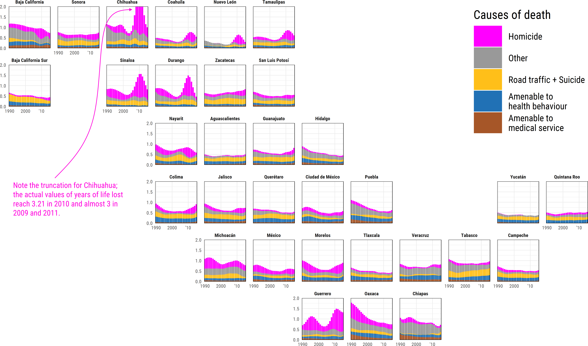
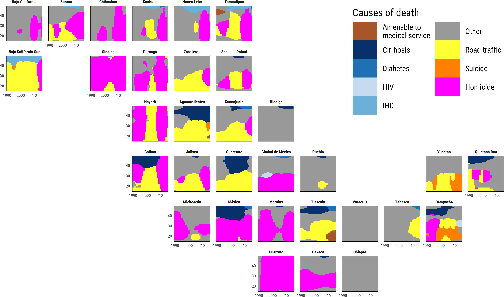
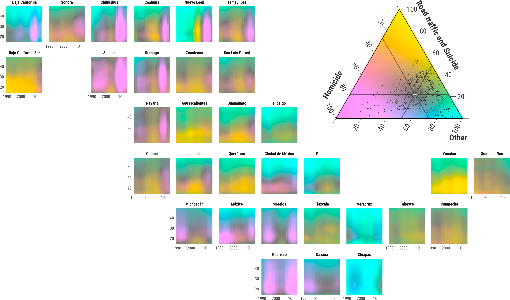
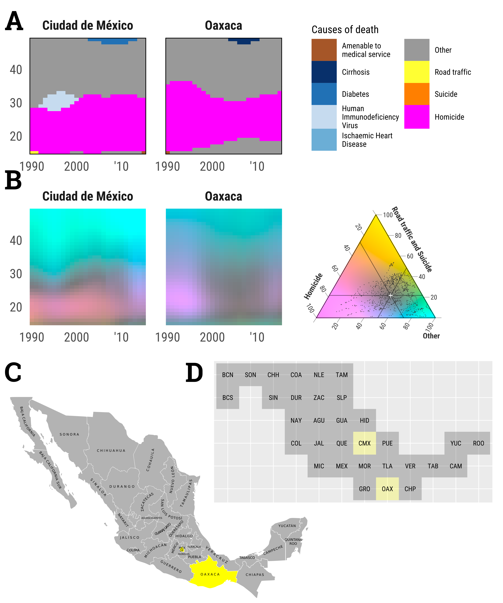

```{r setup, include=FALSE}
library(tidyverse)
library(kableExtra)
library(knitr)
library(bookdown)
options(tinytex.verbose = TRUE)
```

\newpage

# Introduction

In data visualization, it is often challenging to represent multiple relevant dimensions while preserving readability of a plot. This is especially true when the task is to expose spatial variation of some complex phenomenon. In such a case, geographical maps are the natural choice of a visualization framework -- they are meant to show spatial patterns. However, the usual limitation is that only one variable can be  meaningfully represented with colors in a choropleth; so what if the dataset at hand is more complex and demands a balanced exposure of several dimensions?

Usually, time is a dimension difficult to represent, yet it is very important for the story  underlying certain phenomena. Visualizing time series with choropleths is challenging. One has to produce either small multiples for the years or animated pictures with maps for various years flashing sequentially. Both variants make it difficult to compare regions across time, which is the main goal of such visualization. Furthermore, including additional variables, e.g. age, complicates its representation, and the basic choropleth visualization framework fails. An alternative to overcome these limitations is _geofaceting_.  

The idea of geofaceting is simple: a "normal" plot is produced for each of the regions, and then all the small panels are arranged according to their approximate geographic location thereby making it easier to identify regions. The spatial logic of small-multiples alignment helps to identify the units of analysis, usually regions of a country, faster. Moreover, it reveals the macro-level spatial pattern while preserving the flexibility of visualization technique choice for the small-multiples. As a result, creating geofaceted visualizations gives all the advantages of standard plots in which one can easily display at least three dimensions of a dataset. The resulting map-like plots provide a unique opportunity to view multivariate spatial patterns at once. 

Geofaceting has been re-invented multiple times. The use of small-multiples arranged as grids can be found in the famous Galton’s 1863 multivariate weather chart of Europe [@galton1863; @friendly2008hodv]. French geographers of the 19-th century used to utilize another very closely related idea: they overlaid small plots in geographical maps systematically providing additional information for the chosen locations [@palsky1996]. Geofaceting goes one step further by dropping the actual geographical map and just arranging the small-multiples in line with the spatial pattern of the corresponding areas. This approach was recently formalized by Ryan Hafen, received its name, and was consistently implemented in the R package `geofacet` [@hafen2019]. The R package also provides tools for creating and publishing grids for custom territories, thus accumulating a library of community-contributed grids [@hafen2018rh].


 

# Data & Methods

The application of our visualization proposal relies on the results from @aburto2018bo. These are based on cause-of-death information available from the Mexican Statistical Office from 1990 to 2015 [@INEGI], population estimates from the Mexican Population Council and includes 32 Mexican states as geographical units. Data were desegregated by single age, sex, and state. Population estimates were adjusted for age misstatement, undercounting, and interstate and international migration.

Cause-specific death rates were smoothed over age and time for each state and sex separately using 2-d p-spline to avoid random variations [@camarda2012jss]. Smoothed death rates were then constrained to sum to the unsmoothed all-cause death rates. Period life tables were constructed for males from 1990 to 2015 following standard demographic methods [@preston2001, Chapter 3]. The average years lived between ages 15 and 49, temporary life expectancy [@arriaga1984d], were calculated with cause-specific contributions to the difference between state-specific temporary life expectancy and a low mortality benchmark using standard decomposition techniques [@horiuchi2008d].

The low-mortality benchmark was calculated in the basis of the lowest observed mortality rates by age, cause of death, from among all states for a given sex and year. The resulting minimum mortality rate schedule has a unique age profile, and it determines a benchmark temporary life expectancy. The minimum mortality schedule can be treated as the best presently achievable mortality assuming perfect diffusion of the best available practices and technologies in Mexico [@vallin2008p; @canudas-romo2019naaj].

There exists substantial regional variation in young male mortality across Mexican states. Therefore, to visualize properly mortality patterns, it is necessary to take into account the spatial dimension of the dataset, which we achieve with _geofaceting_. As there was no geofacet layout for Mexico, we created one from the scratch. The produced grid for Mexican states was successfully submitted to `geofacet` package [@kashnitsky2017ga]. Though, at the revision stage of the paper, we switched to an improved layout of Mexican states [@zepeda2018g].

There is no way to represent efficiently in one plot both absolute and relative values. Thus, the first two figures complement each other: Figure \@ref(fig:five) uses the _stacked bar plot_ technique to reveal the variation of young adult mortality in Mexican states over time; Figure \@ref(fig:nine) shows the dominant cause of death with a colored _tile plot_ on a standard _Lexis surface_, which can be seen as a categorical version of a _heatmap_ [@scholey2017dr; @rau2018]. 

Focusing on one leading cause of death may mask its relative importance compared with the second, third, and others. Thus, in Figure \@ref(fig:tern) we apply the framework of _ternary colorcoding_, which was recently formalized and streamlined in the R package `tricolore` [@scholey2018]. Ternary colorcoding maximizes the amount of information conveyed with colors by representing each element in a three-dimensional array of compositional data with a single color. Each part of the ternary composition is assigned a hue (color characteristic), and the amount of hue for each data element is proportional to its weight in the ternary composition. For more technical details on the method check @scholeyforthcomingdr (forthcoming); for an indicative use case of ternary colorcoding see @kashnitsky2018tl. Figure \@ref(fig:four) facilitates comparison between Figures \@ref(fig:nine) and \@ref(fig:tern).

The figures presented in this paper are easily reproducible using the replication material that we provide openly [@kashnitsky2019]. R programming language [@rcoreteam2018] was used for the analyses and data visualization; in addition we used packages: `tidyverse` [@wickham2017b], `tricolore` [@scholey2018], `ggtern` [@hamilton2018jss], `hrbrthemes` [@rudis2018], `extrafont` [@chang2014], `RColorBrewer` [@neuwirth2014], and `geofacet` [@hafen2019]  


# Application

To show the usefulness of our proposal, we analyze the contribution of homicide, road traffic accidents, and suicide, medically amenable mortality, and causes amenable to health behavior to the gap in temporary life expectancy between ages 15 and 49 of each of 32 Mexican states with a low mortality benchmark. The category “Amenable to medical service’ refers to those conditions that are susceptible to medical intervention, such as infectious and respiratory diseases, some cancers and circulatory conditions, and birth conditions, among others. For details on codes from International Classification of Diseases revision 10 included in this category, we refer the reader to the original classification [@aburto2018bo]. These causes have emerged as leading among young people, and the first two recently had a sizable impact on life expectancy in Mexico [@aburto2016ha; @aburto2019ajph].

Three complementary geofaceted plots were created. Figure \@ref(fig:five) shows the absolute impact of five causes of death on the difference between the observed life expectancy with the best-practice life expectancy (low benchmark) for young males. For example, it shows how the contribution of homicides (magenta) increased substantially after 2005, particularly in the North, reaching a peak in 2011 for *Chihuahua*, *Sinaloa* and *Durango*, among others. It is also clear from this graph that the most affected state in the South is *Guerrero* since the early 1990s.


(ref:five) Gap between observed and best-practice life expectancy for Mexican states: Years of life lost by cause of death across time (1990-2015).

```{r five, fig.pos="!t", fig.margin = FALSE, fig.cap = "(ref:five)", out.width="100%", echo=FALSE}



```


Figure \@ref(fig:nine) shows state-specific Lexis diagrams with the main cause of death at each age in a given year. It gives a full representation of the main cause of death by age and period compromising on the actual values of the gap, i.e. Figure \@ref(fig:five). For example, from this graph it is clear that homicides are contributing the most across ages between 15 and 49 in most states in the North. However, even though in *Oaxaca* (in the South) the contribution of homicide was decreasing (Figure  \@ref(fig:five)), between ages 20 and 30 homicide remained the main contributor to the gap.


(ref:nine) Gap between observed and best-practice life expectancy for Mexican states: Cause of death contributing the most by age (15-49) and time (1990-2015).

```{r nine, fig.pos="!t", fig.margin = FALSE, fig.cap = "(ref:nine)", out.width="100%", echo=FALSE}



```


To enrich the plot with geofaceted Lexis surfaces (Figure \@ref(fig:nine)), we use ternary colorcoding of the three main groups of causes of death: homicides, road traffic and suicides, and all other causes combined (Figure \@ref(fig:tern)). These causes of death are known to be the main contributors in midlife and through the young mortality hump [@remund2018d]. This plot deepens the previous one by representing the relative importance of the two main causes of death compared with all others pulled together. For example, if we compare *México state* with the neighboring *Guerrero*, their mortality patterns at ages 20-30 seem very similar if we look at Figure \@ref(fig:nine) and focus only at the leading cause of death, homicide. Yet, when we consider the relative importance of homicide in the mortality regime of the two states (Figure \@ref(fig:tern)), it becomes clear that homicide is by far a bigger problem in the state of *Guerrero*. 


(ref:tern) Gap between observed and best-practice life expectancy for Mexican states: Colorcoded ternary compositions of the three leading groups of causes of death by age (15-49) and time (1990-2015).

```{r tern, fig.pos="!t", fig.margin = FALSE, fig.cap = "(ref:tern)", out.width="100%", echo=FALSE}



```


Figure \@ref(fig:four) demonstrates further the usefulness of ternary colorcoding as a way to highlight the story of the homicide crisis. Consider two states -- *Ciudad de México* and *Oaxaca* (Figures \@ref(fig:four)-C and \@ref(fig:four)-D) -- that have very similar profiles when we look at the leading cause of death (Figure \@ref(fig:four)-A). Once the relative importance of the leading causes of death is taken into account (Figure \@ref(fig:four)-B), the differences in mortality regimes between the the states come forward, both in time and age dimensions.

(ref:four) The comparison of the visualization approaches in Figures \@ref(fig:nine) and \@ref(fig:tern), panels A and B, respectively, for two selected states of Mexico, *Ciudad de México* and *Oaxaca*. The locations of the selected states on a geographical map and the used geofacet grid are represented in panels C and D, respectively. 

```{r four, fig.pos="!t", fig.margin = FALSE, fig.cap = "(ref:four)", out.width="100%", echo=FALSE}



```


# Discussion

Geofaceting is an elegant data visualization technique that helps to analyze different dimensions of a complex phenomenon across multiple regions improving on their graphical representation. Essentially, the method proposes to arrange a multi-panel plot (often named as *small-multiples*) according to the geographical location of the regions. The approach preserves the flexibility of a standard plot for each of the regions allowing to depict different dimensions of a dataset. Geofaceting can be seen as an improved alternative to panel matrices / small-multiples grids. 

We demonstrate its usefulness showing the specific case of Mexico and mortality patterns over a fairly large period, 1990-2015. The main advantage of our proposal is that the reader can easily interpret complex phenomena, while being able to identify regional variations. It allows to summarize 4 dimensions (geography, cause of death, age and time) in a single figure. This is particularly important in the case of young males in Mexico that have experienced an unprecedented period of rising homicidal mortality. Moreover, the changing dynamics of violence in the country is a dimension hard to represent graphically, nevertheless with the geofaceting framework the reader can easily get a sense of this. For example, while most of the historically violent states are in the northern part of the country (Figures \@ref(fig:five), \@ref(fig:nine), \@ref(fig:tern)) an upsurge of violence in the South is clear, albeit with different intensities, i.e. absolute gap between states and best-practice life expectancy. Being able to identify variations regionally, but also in terms of intensity, is a great advantage of proposed the visualization technique.

There are some limitations of the approach. For instance, if a territory is divided in a too large or too small number of regions the geofaceting might not be the ideal approach to show complex phenomena. Moreover, if a territory is oddly shaped or the subregions are difficult to align geographically, getting a reasonable regional representation might be impossible. For example, a geofaceted plot of the provinces of Chile would look remarkably close to a one-columned vertical grid. Also, in most cases geofacet grids are unable to reflect exact relative positions of the regions, since boundaries of the neighboring regions can be rather complex. An example of such complexity would be the case when one region is encapsulated completely within the other one -- the answer to the question where to locate the inset region becomes completely arbitrary. Another case is when bordering regions get separated in the geofacet grid -- like *Oaxaca* and *Puebla* in our Mexican plots (see Figures \@ref(fig:four)-C and \@ref(fig:four)-D). Nevertheless, we believe that in the case shown here, geofaceting was a useful tool, which combined with ternary colorcoding provided a macro-representation of a phenomenon, i.e. cause-specific contributions to the gap between states and best-practice life expectancy, and still being able to account for regional variations.


# Acknowledgements

The initial version of the data visualization presented in this paper was originally developed by Ilya Kashnitsky in team work with Michael Boissonneault, Jorge Cimentada, Juan Galeano, Corina Huisman, and Nikola Sander during the dataviz challenge at Rostock Retreat Visualization event in June 2017. IK thanks his team members for the unique experience of productive brainstorming and enthusiastic teamwork. The creative dataviz challenge was developed by Tim Riffe and Sebastian Klüsener, the organizers of Rostock Retreat Visualization.

\clearpage

# References


